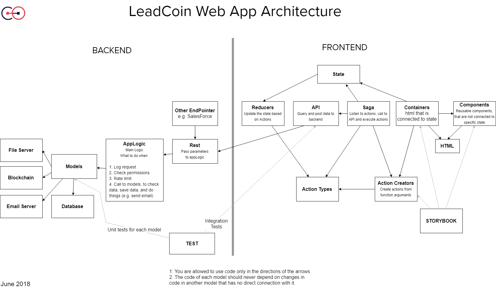

# LeadCoin’s Web App Project

[](https://travis-ci.org/LeadcoinNetwork/Web-App-Project)


A decentralized Lead Sharing Network https://leadcoin.network

This is LeadCoin’s first product code release to GitHub, representing a major milestone and a significant step towards releasing our Alpha in Q3. LeadCoin’s network lets consumers and businesses share their unused leads and earn LDC tokens. Consumers can earn LDC tokens by sharing their data with interested businesses on LeadCoin’s Lead Sharing Network. The data is related to products or services they wish to buy.

**Table of contents**

- [LeadCoin’s Development Status](#leadcoin-s-development-status)
- [Architecture](#architecture)
- [Getting started](#getting-started)
- [Storybook](#storybook)
- [Feedback](#feedback)
- [Contributing](#contributing)
- [Code of Conduct](#code-of-conduct)
- [Disclaimer](#disclaimer)

## LeadCoin’s Development Status

LeadCoin’s development is broken into two projects: the Web App (frontend and backend) and the Smart Contract. We're working on them both simultaneously.

The Frontend - We’ve finished the infrastructure, the architecture, and the design. We’re in the final steps of building the UI. When we finish the backend, we’ll be able to connect the frontend to the backend.
The Backend and the Data Layer - Under development. We finished several API’s that are needed for the frontend, but there are still a lot left to build.  
The Smart Contract (Blockchain Layer) - When we finish to connect the frontend to the backend, we’ll put all the focus on writing the smart contract code.

## Architecture



The frontend is developed using React. We’re developing the frontend using the Story-Driven-Development (SDD) method. We’re writing stories in Storybook for every component and container we're going to use, and then we’re developing the stories. We’re using Webpack for our custom configurations to bundle the frontend, as this allows us to combine all the best aspects of SASS, File-Loaders, Storybook, Dev-Servers, hot-reloading any settings based on our development needs.

The state management system is Redux. We tried to keep all the states of non-reusable components in the store.

Because the state is in the Redux store, we can centralize the application’s logic in one place,the reducers.

For async operations and side effects we're going to use redux-saga middleware. This is where the connection to the backend and the blockchain will be. We're in the first steps. When we finish the backend we'll use Saga's to connect the frontend to the backend.

The backend is developed using NodeJS, Express, and TypeScript. We're going to release what is already done soon, and we'll describe its infrastructure in more detail.

The blockchain is developed using Solidity, and again, we'll give more information about it when it will be deployed.

## Getting started

You can run LeadCoin using Linux, Mac and Windows. The app supports NodeJS 8.5.0 or greater. We only tested it in NodeJS 8.5.0.

1.  [Fork the project](https://github.com/LeadcoinNetwork/leadcoin-web/fork)
2.  Clone the project `git clone https://github.com/LeadcoinNetwork/Web-App-Project/`.
3.  Install all dependencies. `npm i`
4.  Start a storybook `npm run storybook`
5.  Start the client `npm run start`

_Required environment variables:_

```
BACKEND=http://127.0.0.1.xip.io:3000
FRONTEND=http://localhost:8080
PORT=8080
```

## Storybook

Use the below link to interact with the development environment of the UI components. It allows you to browse our component library and view the different states of each component.
http://1.sg.leadcoin.network

## Feedback

- [Join our Telegram](https://t.me/LeadCoinNetwork)
- [Report a bug in GitHub Issues](https://github.com/LeadcoinNetwork/leadcoin-web/issues)
- [Tweet us with other feedback](https://twitter.com/leadcoinnetwork)

## Contributing

The main purpose of this repository is to be open source on GitHub, and we are grateful to the community for contributing bug fixes and improvements.

## Code of Conduct

LeadCoin has adopted a Code of Conduct that we expect project participants to follow. Please read [the full text](CODE_OF_CONDUCT.md) so that you can understand what actions will and will not be tolerated.

## Disclaimer

THE SOFTWARE IS PROVIDED "AS IS", WITHOUT WARRANTY OF ANY KIND, EXPRESS OR IMPLIED, INCLUDING BUT NOT LIMITED TO THE WARRANTIES OF MERCHANTABILITY, FITNESS FOR A PARTICULAR PURPOSE AND NON-INFRINGEMENT. IN NO EVENT SHALL THE AUTHORS OR COPYRIGHT HOLDERS BE LIABLE FOR ANY CLAIM, DAMAGES OR OTHER LIABILITY, WHETHER IN AN ACTION OF CONTRACT, TORT OR OTHERWISE, ARISING FROM, OUT OF OR IN CONNECTION WITH THE SOFTWARE OR THE USE OR OTHER DEALINGS IN THE SOFTWARE.
